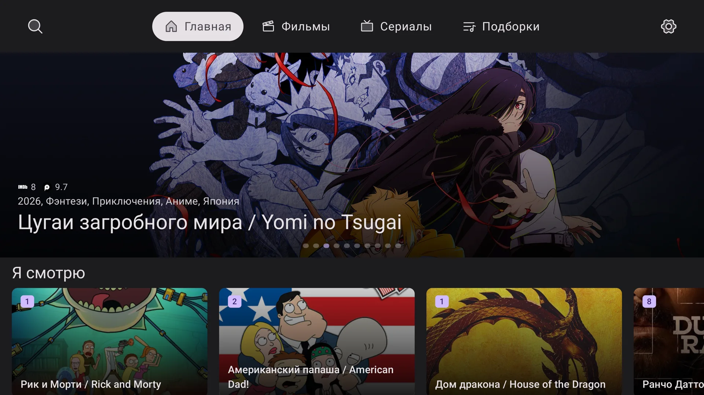
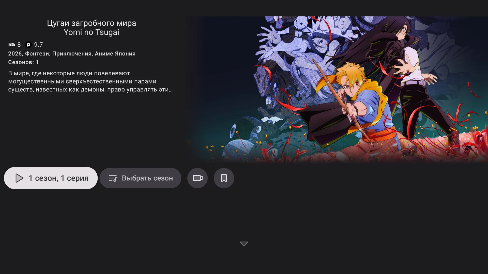
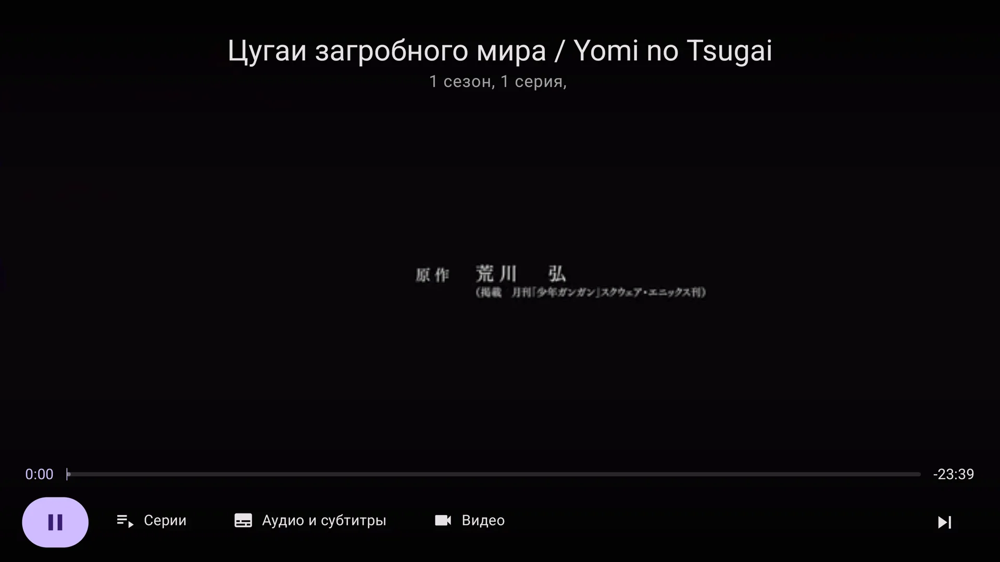
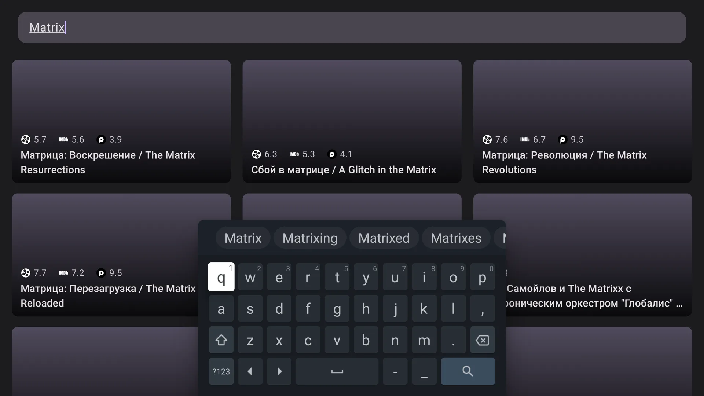
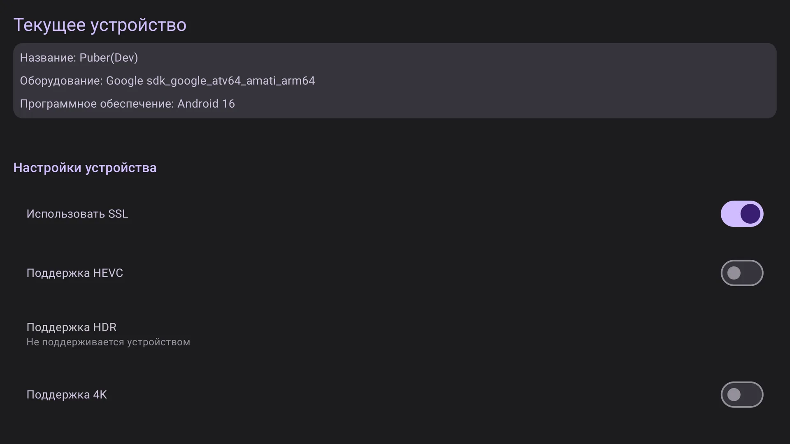

# Puber

<p align="center">
  
</p>

<p align="center">
  <strong>Неофициальный Android TV-клиент для сервиса <a href="https://kino.pub/">KinoPub</a>.</strong><br />
  Сделан для удобного просмотра с дивана, пульта и большого экрана.
</p>

<p align="center">
  
  
  
  
</p>

## Что это

Puber — любительский и некоммерческий клиент для Android TV, который работает с каталогом и API
[KinoPub](https://kino.pub/). Проект не является официальным приложением KinoPub, не связан с правообладателями и не
распространяет видеоконтент. Для использования нужен собственный аккаунт KinoPub и доступ к сервису.

Главная идея простая: дать нормальный TV-first интерфейс для просмотра фильмов, сериалов, подборок и продолжения
просмотра без ощущения, что на телевизор просто растянули мобильное приложение.

## Скриншоты

| Главная витрина | Карточка тайтла |
| --- | --- |
|  |  |

| Плеер | Поиск |
| --- | --- |
|  |  |

| Настройки устройства |
| --- |
|  |

## Что уже умеет

- TV-first навигация: крупные фокусируемые элементы, управление с пульта, верхние табы и экранная структура под 10-foot UI.
- Главная витрина с hero-каруселью, полкой “Я смотрю”, новинками, популярными фильмами/сериалами, закладками и подборками.
- Разделы каталога: фильмы, сериалы, мультфильмы, 4K, концерты, документальное, ТВ-шоу и подборки.
- Детальные карточки с постерами, фонами, рейтингами, описанием, сезонами, трейлером, похожим контентом и быстрыми действиями.
- Полноэкранный плеер на Media3/ExoPlayer с HLS, сериями, аудиодорожками, субтитрами, качеством, скоростью, aspect ratio и настройками буфера.
- “Я смотрю” для отслеживаемых тайтлов, отметки просмотренного, закладки и список “Буду смотреть”.
- Поиск по каталогу с результатами, рейтингами и локализованными/оригинальными названиями.
- Device flow-авторизация: код и QR для привязки устройства к аккаунту KinoPub.
- Настройки устройства и воспроизведения: SSL, HEVC, HDR, 4K, навигация, видимые табы, отладочный overlay.
- Экспериментальный пропуск intro/recap/credits/preview через TheIntroDB, IntroDB.app и TMDB, если для тайтла есть данные.

## Технологии

- Kotlin, Coroutines, Flow.
- Jetpack Compose и AndroidX TV Material.
- Media3 / ExoPlayer для воспроизведения.
- Ktor + OkHttp для API и OAuth.
- Koin для DI.
- Voyager для навигации.
- Coil 3 для изображений.
- kotlinx.serialization для моделей API.
- Detekt и Baseline Profile-инфраструктура.

## Сборка

Проект состоит из модулей `:app` и `:baselineprofile`. Основное приложение живёт в `:app`.

Требования:

- JDK 17.
- Android SDK с compile/target SDK 36.
- Аккаунт KinoPub для реального использования приложения.

Локальные секреты можно передать через `local.properties` или переменные окружения:

```properties
PUBER_CLIENT_SECRET=...
TMDB_READ_ACCESS_TOKEN=...
```

`PUBER_CLIENT_SECRET` нужен для полноценной авторизации через KinoPub OAuth device flow. `TMDB_READ_ACCESS_TOKEN`
используется для экспериментального поиска сегментов intro/credits; без него эта часть может работать ограниченно.

Полезные команды:

```bash
./gradlew :app:compileDevDebugKotlin
./gradlew installDevDebug
```

Dev-сборка устанавливается как `com.kino.puber.stage`, production namespace приложения — `com.kino.puber`.

## Статус проекта

Это pet project / fan project. Он развивается по мере личной необходимости и свободного времени, поэтому без гарантий,
SLA и обещаний “починить сегодня”. Но если что-то ломается или хочется полезную фичу — лучше всего завести
[issue](https://github.com/rovkinmax/Puber/issues) в этом репозитории.

Подойдут:

- баг-репорты с описанием устройства, версии Android TV, сценария и логами, если они есть;
- feature request с понятным пользовательским сценарием;
- UX-идеи для управления с пульта;
- предложения по стабильности плеера, субтитрам, аудио или производительности.

## Дисклеймер

Puber не является официальным клиентом KinoPub и не претендует на принадлежность к сервису. Все названия, постеры,
описания, видео и другие материалы принадлежат их правообладателям и/или соответствующим сервисам. Приложение работает
только как клиент к аккаунту пользователя и не содержит собственного каталога или видеоконтента.
